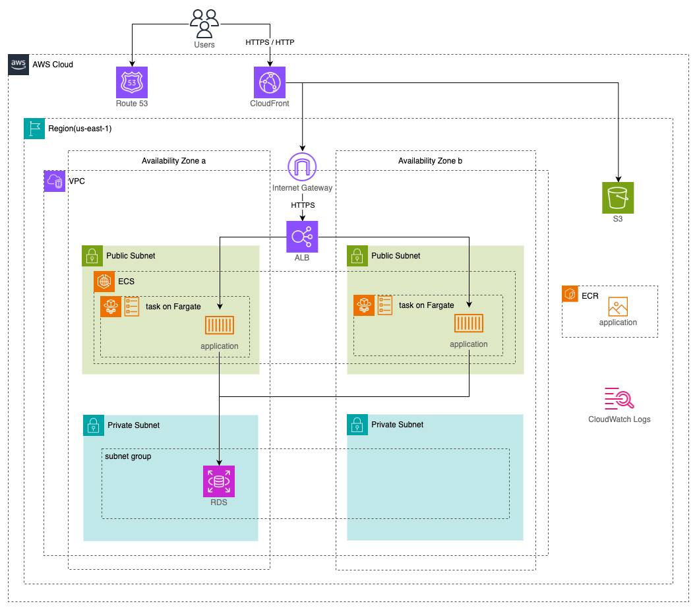

# prerequisites

## tfenv

- `brew install tfenv`
- `tfenv list-remote` or `tfenv list`
- `tfenv install 1.9.5`
- `tfenv use 1.9.5`

# structure

- 本番では WAF, NAT, RDS の multi AZ 構成 が望ましいが、一時的だとしても費用が大きいので省略する

# development

## commands

- `terraform init`
- `terraform plan`
- `terraform apply`
  - `terraform apply -auto-approve`で`yes`入力をスキップ
- `terraform destroy`

## misc

- ディクレトリ構成などは以下を参考とした
  - https://dev.classmethod.jp/articles/terraform-bset-practice-jp/
